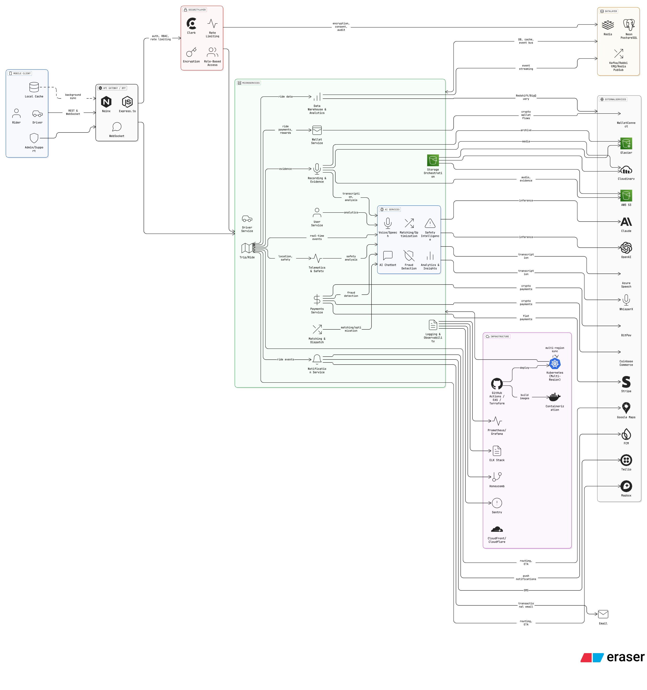
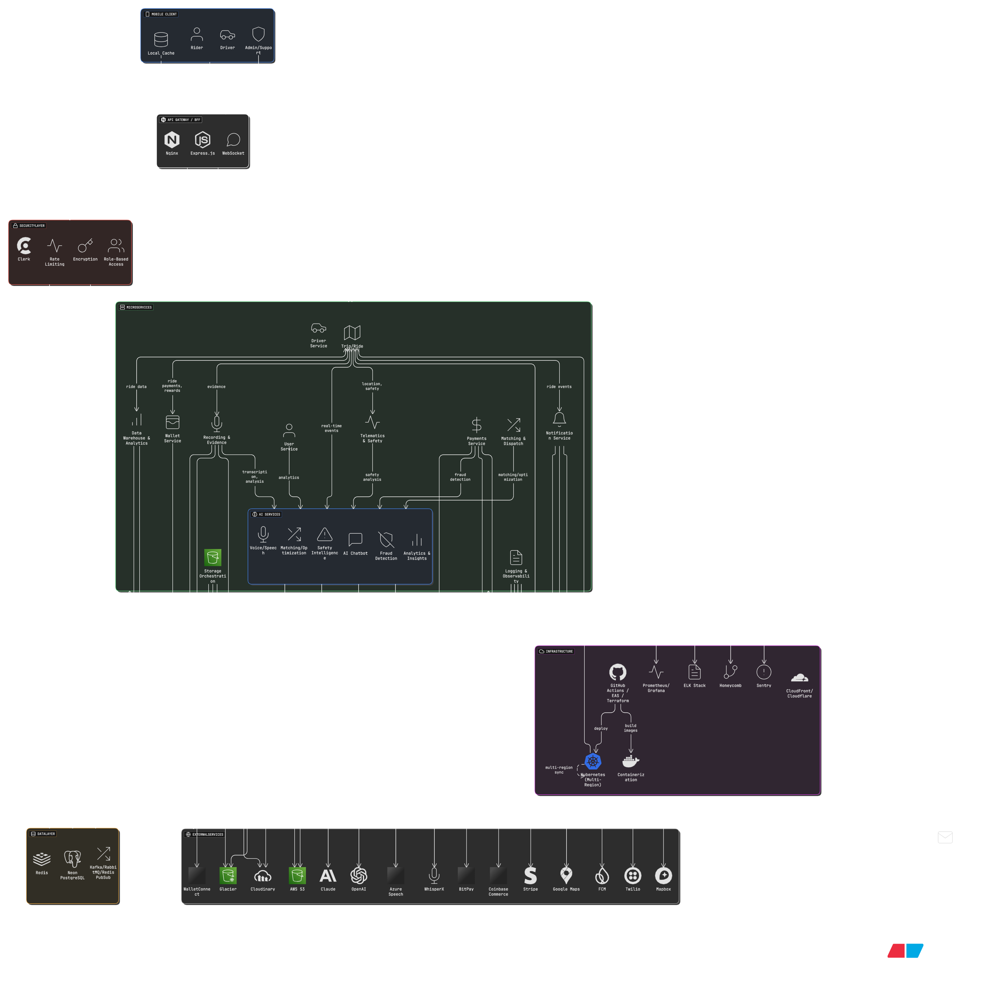

# 🚗 AI-Powered Ride Hailing SuperApp

An intelligent, multi-role ride-hailing application that seamlessly connects **riders** and **drivers** in one app, powered by **AI**, **blockchain payments**, and a **microservices architecture**.  

The app ensures **speed, reliability, and security** through offline-first data sync, distributed microservices, and real-time AI-powered safety and translation features.

---

## 🌍 Overview

This project is built as a **role-based React Native Expo app** with a **TypeScript Express.js backend**, using **Prisma ORM** and **NeonDB (PostgreSQL)** for scalable data management.

It combines traditional and blockchain payments, real-time event streaming, and edge AI capabilities to create a next-generation mobility platform.

---

## 🧱 Tech Stack

### 🖥️ Frontend
- **React Native (Expo, TypeScript)**
- **Clerk** for authentication
- **Redux Toolkit / Zustand** for state management
- **AI Assistant SDK** for ride assistance and translation
- **Offline-first storage** with SQLite / Hive

### ⚙️ Backend
- **Express.js (TypeScript)**
- **Prisma ORM** + **Neon Postgres**
- **Redis** for caching and queues
- **Kafka / PubSub** for ride event streaming
- **WebSockets / Socket.io** for real-time driver-rider communication
- **Microservices** for ride, payment, AI, and notification modules

### 💰 Payments
- **Stripe, Apple Pay, Google Pay**
- **Blockchain Wallets (BTC, SOL, USDT)** integrated via Web3.js / Ethers.js
- **Chainlink** oracles for crypto rate verification

### 🧠 AI Features
- Crash detection and emergency alerts  
- Voice translation and in-ride communication  
- AI assistant for booking, canceling, and scheduling rides  
- Edge AI models (TensorFlow Lite / ONNX) for low-latency inference  

### 🧩 Architecture
- **Clean Architecture** with **Feature-Layered structure**
- **Hybrid consistency model** for offline-first design  
- **Multi-region Active-Active Deployment** for scalability  
- **Edge nodes** for latency-sensitive AI inference  

---

## 🗺️ System Architecture

Below are the key architectural diagrams.  
*(Add your visuals under each heading in column layout — not tables)*

### 🧭 High-Level System Overview
<p align="center">
  
  
</p>

---

## 🚀 Getting Started

### Prerequisites
- Node.js (v18+)
- Docker (for microservices)
- Expo CLI
- NeonDB account
- Clerk API keys
- Redis & Kafka instances

### Installation
```bash
# Clone the repo
git clone repo.git
cd repo

# Install dependencies
npm install

# Run backend
cd server && npm run dev

# Start mobile app
cd ../app && npx expo start
